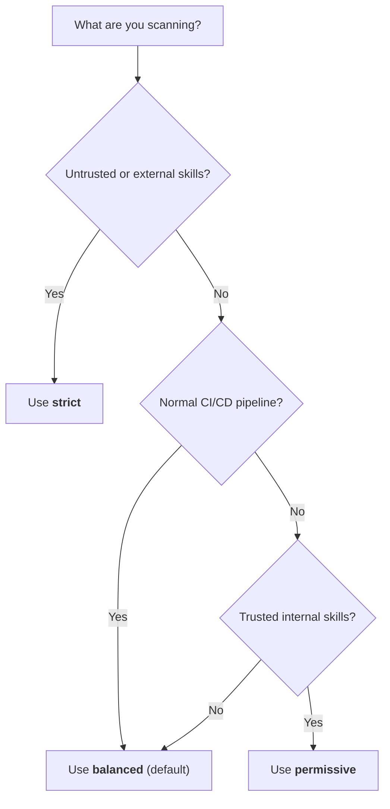

# Scan Policies Overview

Scan policies define scanner behavior without code changes.

## Which Preset Should I Use?



## Built-In Presets

| Preset | Posture | CEL | Correlation | Typical use |
|---|---|---|---|---|
| `strict` | Maximum sensitivity | `shadow` | on | Untrusted content and audits |
| `balanced` | Default blend | `shadow` | on | General CI usage |
| `permissive` | Lower noise | `off` | off | Trusted internal workflows |

## Quick Start

```bash
skill-scanner scan ./my-skill --policy strict
skill-scanner scan ./my-skill --policy balanced
skill-scanner scan ./my-skill --policy balanced --cel-mode off
skill-scanner generate-policy --preset balanced -o my_policy.yaml
```

`--cel-mode off|shadow|enforce` overrides the selected policy for one scan.
`shadow` records decisions in JSON metadata but retains every finding. All
bundled CEL rules currently have per-rule `rollout: shadow`, so choosing the
global `enforce` mode does not suppress them until they are individually
qualified and promoted.

## Merge Behavior

Custom policy files merge over defaults.

- Missing keys inherit defaults.
- Scalar fields override directly.
- Lists replace defaults (they do not append).

## High-Impact Sections

- `pipeline`: command-chain demotion and known installer handling
- `rule_scoping`: docs/code/scope gating
- `file_limits`: max files, file size, depth
- `analysis_thresholds`: thresholds for analyzability and unicode heuristics
- `analyzers.correlation`: bounded source/sink and staged-behavior correlation
- `cel.mode`: CEL decision behavior (`off`, `shadow`, or `enforce`)
- `severity_overrides`: per-rule severity remapping

The core pack is always selected. Additional bundled packs such as ATR remain
opt-in with `--rule-packs`; ATR is not part of the current core + CEL release
gate.

## Next Step

For exhaustive knob-by-knob documentation, see [Custom Policy Configuration](custom-policy-configuration.md).
